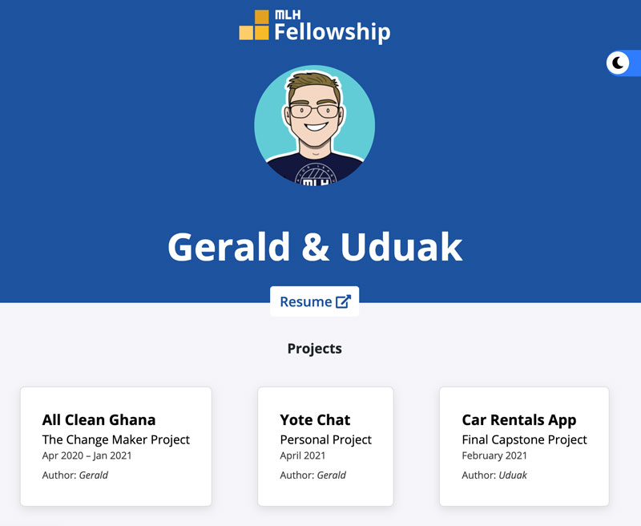

# Team 2 MLH Portfolio (Pod 3.1.4)

This project is a simple page with each members details and skills to be presented to recruiters while applying for jobs and as showcase of our works.

[](https://app.netlify.com/sites/mlh-fellowship-portfolio/deploys)




## Built With

- HTML
- CSS
- Stickler for CSS validation
- FontAwesome
- SASS
- Manifest

## Live Demo
[Live Demo Link](#)


## Video Description
[Video Description](#)

## Getting Started

If you want to test it locally or add some new features, run the below commands. Make sure to have Ruby and Bundler installed.

```
$ git clone https://github.com/BravoClassic/mlh-team2-portfolio.git
```

```
bundle install --path vendor/bundle
bundle exec jekyll serve
```

## Author

**Gerald Akorli**

- Github: [BravoClassic](https://www.github.com/BravoClassic)
- Linkedin: [Gerald](https://www.linkedin.com/in/gerald-a-a698a613a)

**Uduak Essien**

- Github: [@acushlakoncept](https://github.com/acushlakoncept/)
- Twitter: [@acushlakoncept](https://twitter.com/acushlakoncept)
- Linkedin: [acushlakoncept](https://www.linkedin.com/in/acushlakoncept/)

## 🤝 Contributing

Contributions, issues and feature requests are welcome!

Feel free to check the [issues page]( https://github.com/BravoClassic/mlh-team2-portfolio/issues).

## Show your support

Give a ⭐️ if you like this project!

## Acknowledgments

- Project inspired by MLH